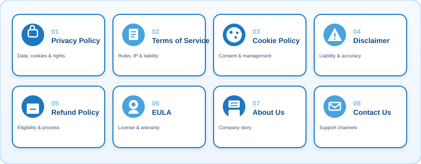
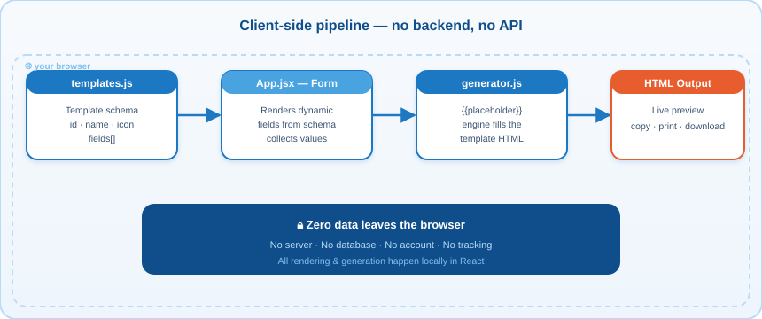
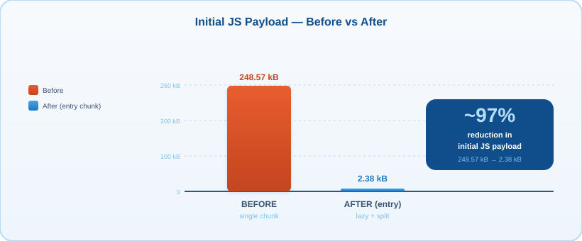
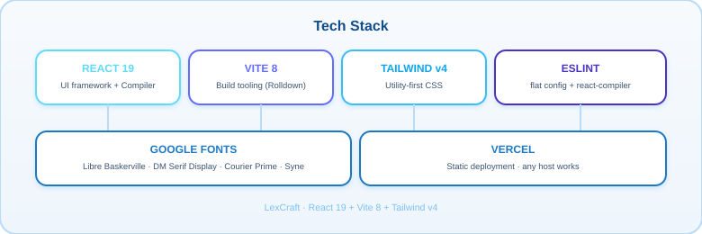

<!-- Banner -->
<p align="center">
  
</p>

<h1 align="center">⚖️ LexCraft — Free Legal Page Generator</h1>

<p align="center">
  <em>Generate clean, ready-to-paste legal pages in seconds — no sign-up, no backend, 100% client-side.</em>
</p>

<p align="center">
  
  
  
  
  
  
</p>

---

<p align="center">
  <a href="#-what-is-lexcraft">What is it</a> ·
  <a href="#-why-lexcraft">Why</a> ·
  <a href="#-legal-page-templates">Templates</a> ·
  <a href="#-how-it-works">How it works</a> ·
  <a href="#-quick-start">Quick Start</a> ·
  <a href="#-project-structure">Structure</a> ·
  <a href="#-performance--bundle-sizes">Performance</a> ·
  <a href="#-tech-stack">Tech Stack</a> ·
  <a href="#-license">License</a>
</p>

---

## 📜 What is LexCraft?

**LexCraft** is a free, open-source web app that helps website owners and developers generate the legal documents every site needs. Pick a template, fill in a short form (company name, website URL, email, jurisdiction…), and instantly get clean **HTML** you can copy, print, or download and drop into any website.

Everything happens **in your browser** — there is no server, no database, and no account required. Your data never leaves your device.

<p align="center">
  <picture>
    <source media="(prefers-color-scheme: dark)" srcset="docs/assets/value-props-dark.svg" />
    
  </picture>
</p>

---

## ✨ Why LexCraft?

| | Feature | What it means for you |
|---|---|---|
| 🔒 | **100% private** | Form data stays in your browser — nothing is uploaded anywhere |
| ⚡ | **Instant output** | Live HTML preview the moment you type |
| 🧩 | **8 legal pages** | All the essential documents a modern site needs |
| 🪶 | **Zero deps for users** | Just one lightweight static bundle |
| 🎨 | **Clean HTML** | Semantic, copy-paste-ready markup — no bloat |
| 💸 | **Free forever** | No sign-up, no paywall, no watermarks |

---

## 🧾 Legal Page Templates

Eight ready-to-go document types — each with its own smart form and rendering logic.

<p align="center">
  
</p>

| # | Template | Icon | What it covers |
|---|----------|:----:|----------------|
| 01 | **Privacy Policy** | 🔒 | Data collection, usage, cookies, third parties, user rights |
| 02 | **Terms of Service** | 📜 | Acceptance, usage rules, IP, liability, termination |
| 03 | **Cookie Policy** | 🍪 | Cookie types, consent, and how to manage them |
| 04 | **Disclaimer** | ⚠️ | General liability, accuracy, and external-link notices |
| 05 | **Refund Policy** | 💳 | Eligibility, timeframes, and refund process |
| 06 | **EULA** | 💿 | License grant, restrictions, and warranty terms |
| 07 | **About Us** | 🏢 | Company story, mission, and team intro |
| 08 | **Contact Us** | ✉️ | Email, address, and support channels |

---

## ⚙️ How It Works

LexCraft is a tiny, purely client-side pipeline. No backend, no API calls — just React, a template engine, and you.

<p align="center">
  
</p>

**1. Template selection** — `templates.js` defines each page's schema: an `id`, `name`, `icon`, `description`, and a list of `fields` (inputs, textareas, selects, dates).

**2. Dynamic form** — `App.jsx` reads the selected template and renders the matching form fields in real time.

**3. Generation** — `generator.js` takes the filled fields and substitutes them into the template's HTML using a `{{placeholder}}` engine, producing a complete legal document.

**4. Output** — The rendered HTML is shown in a live preview panel. You can **copy**, **print**, or **download** it and paste it straight into your site.

---

## 🚀 Quick Start

> **Prerequisites:** [Node.js](https://nodejs.org/) (v18+ recommended) and npm.

```bash
# 1. Clone the repository
git clone https://github.com/NSKWeb/legal-page-generator.git
cd legal-page-generator

# 2. Install dependencies
npm install

# 3. Start the dev server (with hot module replacement)
npm run dev
#    → http://localhost:5173

# 4. Create a production build
npm run build

# 5. Preview the production build locally
npm run preview

# 6. Lint the codebase
npm run lint
```

### NPM Scripts

| Script | Description |
|--------|-------------|
| `npm run dev` | Start the Vite dev server with HMR |
| `npm run build` | Production build into `dist/` |
| `npm run preview` | Locally preview the production build |
| `npm run lint` | Run ESLint over the project |

---

## 📁 Project Structure

```
legal-page-generator/
├── index.html              # App shell + SEO / OpenGraph / structured-data meta
├── vite.config.js          # Vite config (React + Tailwind v4, chunks, terser)
├── eslint.config.js        # Flat ESLint config (+ React Compiler rule)
├── package.json            # Scripts, deps & sideEffects:false
├── vercel.json             # Vercel deployment config
├── public/                 # Static assets served as-is
│   ├── favicon.svg
│   ├── icons.svg
│   ├── robots.txt
│   └── sitemap.xml
├── docs/assets/            # README infographics & diagrams (SVG)
└── src/
    ├── main.jsx            # Entry — lazy-loads <App/> with <Suspense>
    ├── App.jsx             # UI: template picker, form, live preview, export
    ├── App.css             # Component-scoped styles
    ├── index.css           # Global styles + Tailwind + Google Fonts
    ├── generator.js        # {{placeholder}} engine → renders final HTML
    ├── templates.js        # 8 legal-page template definitions & field schemas
    └── assets/             # Bundled images (hero.png, react.svg, vite.svg)
```

### Core modules

```
templates.js   ─►  schema (id, name, icon, fields[])
                    │
App.jsx        ─►  reads schema → renders dynamic form → collects field values
                    │
generator.js  ─►  fill(template, fields) → final HTML document string
                    │
                 ─►  live preview · copy · print · download
```

---

## 📊 Performance & Bundle Sizes

LexCraft is optimised for fast initial loads through code splitting, vendor chunk caching, and tree-shaking.

<p align="center">
  
</p>

### Initial JS payload: 248.57 kB → 2.38 kB (~97% reduction)

| Chunk | Before | After | gzip |
|-------|-------:|------:|-----:|
| Entry (`index-*.js`) | 248.57 kB | **2.38 kB** | 1.20 kB |
| App (lazy `App-*.js`) | — | 58.23 kB | 15.55 kB |
| React vendor (cached) | — | 188.91 kB | 59.89 kB |
| CSS (`index-*.css`) | 21.04 kB | 21.04 kB | 5.39 kB |

### Optimisations applied

- **Manual chunks** — React/ReactDOM split into a `react-vendor` chunk that caches across deploys.
- **Lazy loading** — `App` is loaded on demand via `React.lazy()` + `<Suspense>`.
- **Console cleanup** — `console.log`/`debugger` stripped from production builds (terser).
- **Performance hints** — `dns-prefetch` + `preconnect` for Google Fonts in `index.html`.
- **React Compiler** — enabled with the `react-compiler` ESLint rule for React 19.
- **Tree-shaking** — `sideEffects: false` in `package.json`.

---

## 🛠️ Tech Stack

<p align="center">
  
</p>

| Layer | Technology |
|-------|------------|
| **UI framework** | React 19 (+ React Compiler) |
| **Build tooling** | Vite 8 (Rolldown) |
| **Styling** | Tailwind CSS v4 (via `@tailwindcss/vite`) |
| **Linting** | ESLint (flat config, react-hooks + react-refresh + react-compiler) |
| **Deployment** | Vercel (`vercel.json`) |
| **Fonts** | Google Fonts — Libre Baskerville, DM Serif Display, Courier Prime, Syne |

---

## 🌐 Deployment

LexCraft is configured for **Vercel** out of the box (`vercel.json`). Any static host works too — just run `npm run build` and serve the `dist/` folder (Netlify, GitHub Pages, Cloudflare Pages, etc.).

---

## 🤝 Contributing

Contributions are welcome! Whether it's a new template, a bug fix, or an improvement to the generator logic:

1. Fork the repository
2. Create a feature branch (`git checkout -b feat/my-template`)
3. Commit your changes (`git commit -m "feat: add new template"`)
4. Push to the branch (`git push -u origin feat/my-template`)
5. Open a Pull Request

Please run `npm run lint` before submitting a PR.

---

## 📄 License

This project is licensed under the **MIT License** — see the [LICENSE](./LICENSE) file for details.

> ⚠️ **Legal disclaimer:** LexCraft generates template documents for convenience only and does **not** constitute legal advice. Always have a qualified attorney review any legal document before publishing it on your website.

---

<p align="center">
  <sub>Built with ⚖️ by <a href="https://github.com/NSKWeb">NSKWeb</a> · Powered by React + Vite</sub><br/>
  <sub>If you found LexCraft useful, please ⭐ the repo!</sub>
</p>
